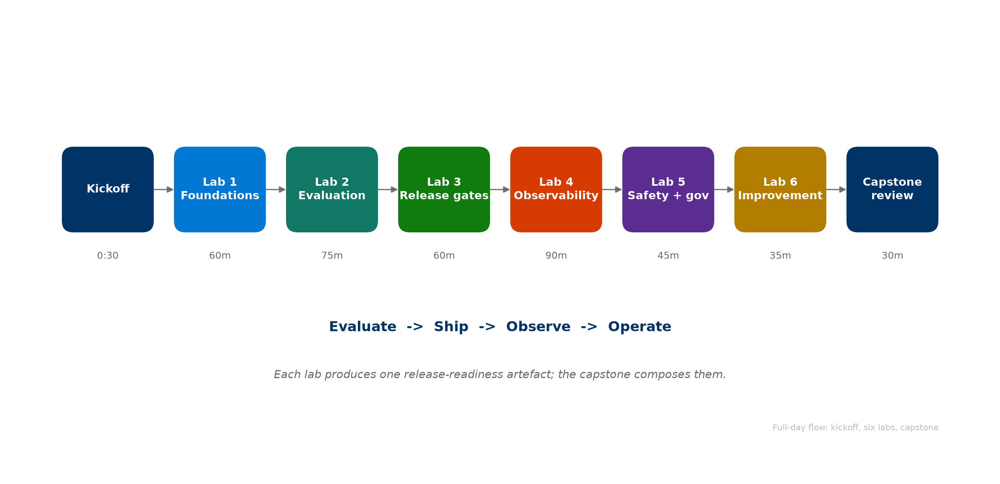
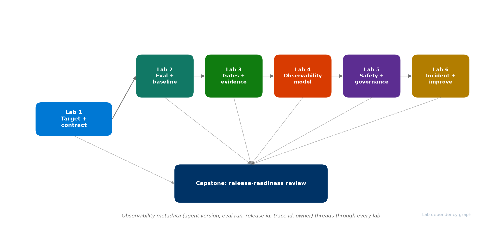
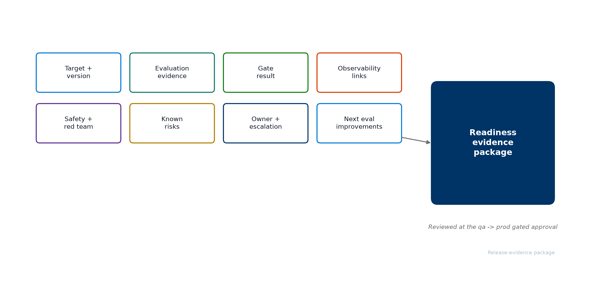
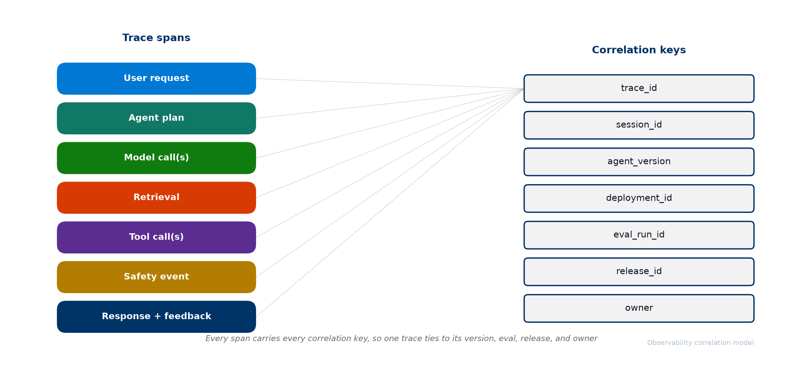
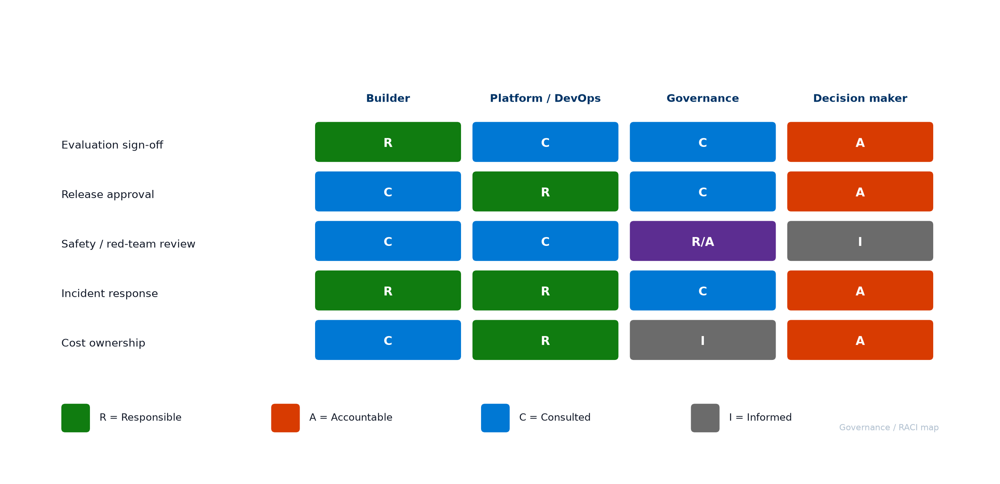

<!-- _class: lead -->

# AgentOps Value Delivery Workshop
## Take one of your agents to production - with evidence

<!-- Speaker notes:
- Welcome. This is the full-day, hands-on AgentOps workshop. Where the briefing answers "what is AgentOps", today answers "how do I actually ship one of my agents".
- By the end of the day, each of you will have a release-readiness package filled in for one of your own production-candidate agents, plus a 30-day plan.
- Audience: builders, architects, DevOps/platform, governance, and decision makers. Mixed on purpose - the labs stay no-code / low-code.
- Control plane is Microsoft Foundry; runtime observability is Azure Monitor + Application Insights; the concrete tooling in the labs is the open-source AgentOps Accelerator.
- Let us look at how the day runs.
-->

---

# How today runs

<!-- Speaker notes:
- One kickoff, six hands-on labs, a capstone, and a closeout. About 8 hours of content plus breaks.
- The labs map onto the four-pillar operating model: Evaluate, Ship, Observe, Operate.
- Every lab produces one artefact that contributes to release readiness. The capstone composes them into a single go/no-go decision.
- Morning (Labs 1-3) builds the release contract and the evidence to ship. Afternoon (Labs 4-6) makes production behavior observable, safe, and continuously improving.
- The deepest lab is Lab 4, observability - we protect time for it.
-->

---

# Agenda

1. **AgentOps Foundations** - the production gap and the four-pillar model
2. **Evaluate** - the release signal: datasets, evaluators, thresholds, baselines
3. **Ship** - CI/CD gates, environment promotion, and release evidence
4. **Observe** - traces, correlation, dashboards, alerts, and the closed loop
5. **Operate** - safety, governance, incident response, continuous improvement
6. **Capstone and next steps** - compose the evidence, decide, and plan 30 days

<!-- Speaker notes:
- Six blocks, each paired with a hands-on lab.
- We open with Foundations, then walk the four pillars in order, each anchored by a lab.
- We close with the capstone, where the four pillars become one story, and a 30-day plan.
- The operating model is the narrative all day; the accelerator is the "how", not the topic.
-->

---

<!-- _class: lead -->

# AgentOps Foundations
## Why agents need a new operating discipline

<!-- Speaker notes:
- This is the kickoff section, about 30 minutes before Lab 1.
- Goal: align on the production gap, the four-pillar model, and the maturity move.
-->

---

# The production gap

> The bottleneck moved from building the first demo to proving that the next version is safe to release

- A GenAI prototype takes days. Production takes proof.
- Agents add non-determinism, tool-calling risk, prompt regression, and changing user behavior.
- Production introduces new operational risk: quality, safety, monitoring, cost, operations, and release confidence.

<!-- Speaker notes:
- Teams stand up a prototype quickly, then stall at production. That gap is what AgentOps closes.
- The question every team hits: can we safely ship this, and where is the evidence?
- Today we build that evidence for one real agent.
- The discipline that answers the gap is an operating model with four pillars.
-->

---

# The four-pillar AgentOps model

> Evaluate, Ship, Observe, Operate - the repeatable loop around Foundry

| Pillar | Question it answers | Example practices |
|---|---|---|
| **Evaluate** | Is this version good and safe enough? | golden datasets, evaluators, thresholds, red teaming |
| **Ship** | What stops a bad version reaching users? | CI/CD gates, environment promotion, release evidence |
| **Observe** | What did it do in production, and why? | traces, correlation, dashboards, alerts |
| **Operate** | How do we run, fix, and improve it? | safety, governance, incidents, continuous improvement |

<!-- Speaker notes:
- AgentOps applies DevOps discipline to systems whose behavior is probabilistic and where releases need evidence.
- AgentOps is the operating model; Microsoft Foundry is the control plane; the AgentOps Accelerator is one concrete implementation path.
- We use exactly these four pillars all day. We do not use the older six-step loop or the word "Own" - the fourth pillar is Operate.
- The output of the loop is release evidence and operational confidence.
-->

---

# Foundry is the control plane

> Foundry stays the control plane - AgentOps connects Foundry signals to release decisions and Day-2 action

- **Capabilities:** agents and versions, quality and safety evaluators, agent-specific evaluators, the AI Red Teaming agent, OpenTelemetry tracing, Content Safety.
- **Runtime:** Azure AI projects, model deployments, tool / MCP servers, Application Insights and Log Analytics.
- **AgentOps adds** the repeatable operating model around Foundry - it is not a replacement.

<!-- Speaker notes:
- Foundry orchestrates the agent lifecycle, models, evaluation, tracing, safety, and governance.
- AgentOps connects those signals to release decisions, repo-side practices, CI/CD gates, readiness checks, diagnostics, and Day-2 operations.
- In the labs, the AgentOps Accelerator (Azure/agentops) makes this tangible: agentops init, eval, workflow, doctor, telemetry, cockpit.
- Next: where do teams sit today, and where do they start?
-->

---

# Maturity, and where to start

> Most teams sit between Initial and Defined - move one production-candidate agent up one level

- **Initial:** ad hoc demos, manual eval, no gates, scattered logs.
- **Defined:** versioned prompts and agents, pre-prod eval datasets, CI builds artefacts.
- **Managed:** quality and safety gates in CI, continuous evaluation, runbooks and SLOs.
- **Optimised:** drift and cost guardrails, canary plus auto-rollback, feedback flywheel.

**Start with one agent.** Do not boil the ocean.

<!-- Speaker notes:
- The practical move is to pick one production-candidate agent and move it up one level - that is the whole workshop.
- Today each of you picks that agent in Lab 1 and carries it through every pillar.
- Set a concrete goal: reach the next maturity level on this one agent within 90 days.
- Let us start: Lab 1 establishes the target and the release-readiness contract.
-->

---

# How the labs connect

<!-- Speaker notes:
- Lab 1 defines the target and the contract; everything else fills it in.
- Labs 2 and 3 build the release evidence; Labs 4-6 make production observable, safe, and improving.
- The observability metadata - agent version, eval run, release id, trace id, owner - threads through every lab and is consumed by the capstone.
- Keep your artefacts consistent: the same agent_id and version everywhere.
-->

---

<!-- _class: lead -->

# Lab 1: Foundations and Control Plane
## 60 min - agent target inventory + release-readiness contract

<!-- Speaker notes:
- Hands-on now. Open the Lab 1 page.
- You will inventory candidate agents, pick one, map it onto Foundry and your repo with agentops init, and write the release-readiness contract.
- Artefacts: agent target inventory and release-readiness contract.
- Time-box the agent choice - it is reversible. The point is the pattern.
-->

---

<!-- _class: lead -->

# Evaluate
## The release signal for agentic systems

<!-- Speaker notes:
- Pillar 1. Without a quality signal there is nothing to ship with confidence.
- This section sets up Lab 2.
-->

---

# Evaluation is the release signal

> Evaluation is not a one-time score - it is the signal that grows as production teaches you new failure modes

- Start with a small **golden dataset** tied to real user journeys - a few dozen real cases beat zero.
- Score **quality** (intent resolution, task adherence, relevance, coherence), **groundedness**, **agent metrics** (tool call accuracy), and **content safety**.
- Compare against a **baseline** - the last good version, not just an absolute bar.
- Promote reviewed production traces into future regression rows.

<!-- Speaker notes:
- Use Foundry's built-in evaluators. The eval dataset is a living artefact.
- The release signal is the comparison vs baseline: did this version regress, and against what?
- In Lab 2 you run agentops eval analyze, eval run, capture a baseline, then make a change and compare.
- Quality alone is not enough - we also test adversarial behavior, which we cover in the Operate section and Lab 5.
-->

---

# Thresholds turn scores into decisions

> Decide what "good enough to ship" means - numerically - before you need it

- **Hard-gate metrics** (quality, safety) block the release if they drop below threshold.
- **Soft signals** (latency, cost) become alerts, not hard blocks.
- A candidate may not regress a hard-gate metric below threshold, nor drop more than your chosen delta vs baseline.

<!-- Speaker notes:
- Thresholds are the contract between evaluation and the CI/CD gate in the next pillar.
- Hard gates stop releases; soft signals inform operations.
- In Lab 2 you fill in the baseline and threshold plan; in Lab 3 the gate enforces it.
- The accelerator captures the baseline file and grows a Comparison vs Baseline section in the report.
-->

---

<!-- _class: lead -->

# Lab 2: Evaluation Design
## 75 min - evaluation dataset plan + baseline and threshold plan

<!-- Speaker notes:
- Open the Lab 2 page.
- You will map journeys to ~20-40 real cases, run agentops eval run, capture a baseline, then make a small prompt change and compare to see a regression delta.
- Artefacts: evaluation dataset plan and baseline and threshold plan.
- Push back on hundreds of synthetic cases - twenty real ones are worth more.
-->

---

<!-- _class: lead -->

# Ship
## Gates that enforce release evidence

<!-- Speaker notes:
- Pillar 2. Signals without enforcement are just reports nobody reads.
- This section sets up Lab 3.
-->

---

# CI/CD gates for agentic AI

> The strongest moment in AgentOps is a failed gate - the pipeline stops before users feel the regression

- **PR gate:** blocks bad prompts before merge.
- **Deploy gate:** blocks bad versions before the next environment.
- **Promotion:** sandbox -> dev -> qa -> prod, checks stricter per environment; evidence is locked at qa; prod runs smoke tests plus blue-green / canary.
- Every gate produces an artefact: eval report, readiness report, release evidence.

<!-- Speaker notes:
- This is where DevOps discipline meets agentic systems.
- The accelerator scaffolds these: agentops workflow analyze recommends the shape, agentops workflow generate writes the workflow files.
- The lesson in Lab 3 is the failed gate - everyone should see a red check on a regressing PR, not just a passing one.
- prod does not re-evaluate - the evidence is locked at qa. This surprises teams.
-->

---

# Release evidence is the reviewable record

<!-- Speaker notes:
- The readiness evidence package is the single record a human reviews to approve a release.
- Eight sections: target/version, evaluation, gate result, observability, safety, known risks, owner, next improvements.
- agentops doctor --evidence-pack projects most of it automatically into evidence.json and evidence.md.
- The gated approval between qa and prod reviews this package - it is evidence-backed, not a rubber stamp.
- In Lab 3 you generate it and map it back to the release-readiness contract from Lab 1.
-->

---

<!-- _class: lead -->

# Lab 3: Release Gates and Evidence
## 60 min - CI/CD gate plan + readiness evidence package

<!-- Speaker notes:
- Open the Lab 3 page.
- You will generate a workflow, force a failed PR gate, then produce the readiness evidence package with agentops doctor --evidence-pack.
- Artefacts: CI/CD gate plan and readiness evidence package.
- Make sure everyone sees the red check - that is the highlight of the morning.
-->

---

<!-- _class: lead -->

# Observe
## Traces, correlation, and the closed loop

<!-- Speaker notes:
- Pillar 3, and the deepest part of the day. This section sets up Lab 4.
- For agents, the unit of understanding is the trace, not the endpoint status.
-->

---

# Observability for agents is more than monitoring

> Infrastructure monitoring asks "is the service healthy?" Agent observability asks "what did it do and why?"

- The unit of understanding is the **trace** - the chain of decisions.
- Required signals: prompt, plan, model call, retrieval, tool call, safety event, latency, cost, feedback, release version.
- Without **correlation**, observability is just disconnected dashboards.

<!-- Speaker notes:
- Foundry captures plan, model, tool, and safety spans via OpenTelemetry; the application adds business context and release metadata.
- The honest gap most teams have: Foundry knows the model, but not which release_id shipped a behavior - unless you attach it.
- That correlation is what lets one trace answer questions across release, runtime, evaluation, and Day-2.
-->

---

# Correlation is the whole game

<!-- Speaker notes:
- Seven correlation keys must be present on every production trace: trace_id, session_id, agent_version, deployment_id, eval_run_id, release_id, owner.
- With them, one trace ties back to its version, the evaluation that shipped it, the release decision, and the owner to route to.
- Lab 1 defined these keys; Lab 4 makes them present on every trace; the capstone uses them.
- This is the difference between aspirational observability and a real thread.
-->

---

# From telemetry to action

> The end state is not a dashboard - it is action: observe, diagnose, improve, ship the next version with evidence

| Signal | Action |
|---|---|
| Latency spike | Azure Monitor alert -> on-call |
| Tool error rate | disable tool, fall back to manual |
| Safety violation | block plus content safety incident |
| Eval score drop | pause canary, open ticket |
| Cost anomaly | throttle via gateway, notify FinOps |
| Positive feedback | sample into eval dataset |

<!-- Speaker notes:
- An alert without a runbook action is noise. Every signal maps to a concrete response.
- The closed loop: a trace explains a failure; a reviewed trace becomes a new eval row; the row enters the gate; the gate prevents recurrence.
- That is how Observe feeds Operate, and how Operate feeds the next Evaluate and Ship cycle.
- In Lab 4 you design four dashboard views, map alerts to actions, and promote one real trace into an eval row.
-->

---

<!-- _class: lead -->

# Lab 4: Observability and Trace-Driven Operations
## 90 min (deepest) - correlation model + dashboard and alert plan

<!-- Speaker notes:
- Open the Lab 4 page. This is the lab we protect time for.
- You will define a trace schema, wire the seven correlation keys, import telemetry, design four dashboard views, map alerts to actions, and close the loop with agentops eval promote-traces.
- Artefacts: observability correlation model and dashboard and alert plan.
- The key "aha": discovering the missing release metadata on your traces.
-->

---

<!-- _class: lead -->

# Operate
## Running agents in production safely

<!-- Speaker notes:
- Pillar 4. Shipping is not the finish line - it is where operational work begins.
- This section sets up Labs 5 and 6.
-->

---

# Safety is a different signal from quality

> Quality asks "is the answer good?" Red teaming asks "can someone make it misbehave?" Both are required

- Four risk categories: **harmful content**, **jailbreak / prompt injection**, **hallucination**, **data exfiltration**.
- Foundry's AI Red Teaming agent (PyRIT) automates adversarial probes.
- Cadence: pre-release gate, scheduled scans, post-incident.
- A finding is **closed only when an eval row covers it** - not when it is fixed once.

<!-- Speaker notes:
- A quality score will not catch a jailbreak. Safety needs its own signal and its own follow-through.
- The follow-through loop is the lesson: every red-team finding becomes an adversarial eval row that the PR gate would catch next time.
- In Lab 5 you scope risks, run a scan, and follow findings through to eval coverage.
-->

---

# Governance: who is accountable

<!-- Speaker notes:
- Ambiguous accountability is the most common reason agents stall before production.
- The RACI map names who is Responsible, Accountable, Consulted, and Informed for evaluation sign-off, release approval, safety review, incident response, and cost ownership.
- The common finding: "nobody" owns release approval today. Surface it as a finding, not a failure.
- In Lab 5 you fill in this map for your own agent and organization.
-->

---

# Incidents and continuous improvement

> Containment first, evidence-backed fix second, and every incident leaves behind a test

| Severity | Example | First action |
|---|---|---|
| S1 Critical | Safety event or data leak | Stop gate, rollback to last good version |
| S2 High | Quality / grounding regression | Planned rollback or version pin |
| S3 Medium | Latency or cost spike | Rate-limit, investigate, then act |
| S4 Low | Single-metric drift | Schedule in the next eval cycle |

**Detect -> Correlate trace -> Identify version -> Contain -> Analyze -> Fix -> Re-evaluate -> Close with evidence**

<!-- Speaker notes:
- The severity table sets expectations so teams neither over- nor under-react.
- The triage flow makes containment explicit - stop the bleed before debugging.
- Continuous improvement: reviewed production traces are promoted into eval rows with agentops eval promote-traces. The four-pillar loop closes when Operate feeds the next Evaluate and Ship cycle.
- Model lifecycle (deprecation, new versions, cost pressure) is handled the same way: treat a model change as a release candidate, not a config flip.
- Labs 5 and 6 produce the safety/governance and the incident/improvement plans.
-->

---

<!-- _class: lead -->

# Labs 5 and 6
## 45 + 35 min - safety and governance, then incidents and improvement

<!-- Speaker notes:
- Open Lab 5, then Lab 6.
- Lab 5: scope risks, run a red-team scan, follow findings to eval rows, and draw the RACI map.
- Lab 6: define the severity model, walk one incident end to end, and promote the trace into eval coverage.
- Keep each focused: in Lab 6, one incident walked completely beats several half-walked.
-->

---

<!-- _class: lead -->

# Capstone: Production-Readiness Review
## 30 min - compose the evidence and decide

<!-- Speaker notes:
- This is where the four pillars become one story.
- You will assemble the readiness evidence package, walk one trace from interaction to owner, walk the eight contract criteria, and record a go/no-go decision.
- For every "not met" criterion, write one action with an owner and a date - that is your 30-day plan.
-->

---

# The capstone question

> If this agent produces a bad answer in production tomorrow, can we find the trace, understand what happened, identify the shipped version, route it to the right owner, and prevent the same failure in the next release?

- Answer yes with evidence -> the agent is ready.
- Any missing link -> that is your 30-day plan.

<!-- Speaker notes:
- This single question is the spine of the whole workshop.
- The capstone proves the observability thread is real: one trace, walked from trace_id to agent_version to eval_run_id to release_id to owner, with no missing link.
- Resist passing everyone. A no-go with a clear 30-day plan is a successful outcome.
-->

---

# Your 30-day plan

1. **Pick one agent** that is close to production (done in Lab 1).
2. **Evaluate** it with release criteria and a small dataset.
3. **Ship** it with PR gates, deploy gates, and readiness evidence.
4. **Observe** it with traces, correlation, dashboards, and alerts.
5. **Operate** it with safety follow-through, governance, and incident response.
6. **Feed learnings** back into the next evaluation cycle.
7. **Revisit the maturity model** - aim for the next level within 90 days.

<!-- Speaker notes:
- You do not need to boil the ocean. One agent, the four pillars end to end.
- Once the pattern is proven on one agent, it scales across the portfolio without re-litigating every decision.
- Take the artefacts with you - they are your release-readiness package.
-->

---

<!-- _class: lead -->

# Thank You!

<!-- Speaker notes:
- Thank you for the full day. You leave with a release-readiness package and a 30-day plan for one agent.
- Reach out to your account team to continue, and explore the AgentOps Accelerator docs for pipeline, dashboard, and Doctor depth.
-->

---

# Resources

> Further reading

| Resource | URL |
|---|---|
| AgentOps Accelerator | https://github.com/Azure/agentops |
| Evaluation approach in Foundry | https://learn.microsoft.com/azure/ai-foundry/concepts/evaluation-approach-gen-ai |
| Agent evaluators | https://learn.microsoft.com/azure/ai-foundry/concepts/evaluation-evaluators/agent-evaluators |
| Agent development lifecycle | https://learn.microsoft.com/azure/ai-foundry/agents/concepts/development-lifecycle |
| Trace agent overview | https://learn.microsoft.com/azure/ai-foundry/observability/concepts/trace-agent-concept |
| Monitor agents dashboard | https://learn.microsoft.com/azure/ai-foundry/observability/how-to/how-to-monitor-agents-dashboard |
| AI red teaming agent | https://learn.microsoft.com/azure/ai-foundry/how-to/develop/run-ai-red-teaming-cloud |

<!-- Speaker notes:
- Reference links for deeper exploration of each pillar.
- The accelerator docs site links pipelines, dashboards, Doctor checks, and evaluator reference.
-->
