<!-- _class: lead -->

# Production Readiness Workshop Topic 4 - AgentOps
## From Agent Prototype to Production

<!-- Speaker notes:
- Every team building with GenAI hits the same question - can we safely ship this, and where is the evidence?
- That is what this session addresses: the operating model for moving AI agents from prototype to production on Microsoft Foundry
- Audience: AI application builders, architects, DevOps and platform teams, AI governance stakeholders, and technical decision makers
- Prerequisites in the broader program: Topic 2 (AI Landing Zones) and Topic 3 (Agent Architectures)
- Let us look at the agenda
-->

---

# Agenda

1. **AgentOps Foundations** - why AI ops is different and the four-pillar model
2. **Demo** - the operating model in action on Foundry
3. **Evaluate** - quality, grounding, behavior, and red teaming
4. **Ship** - gates, evidence, approvals, and environment promotion
5. **Observe** - traces, correlation, telemetry, and feedback
6. **Own** - incident response, model lifecycle, cost, and capacity
7. **Adoption** - start with one production-candidate agent

<!-- Speaker notes:
- We have seven blocks to cover in fifty minutes - here is how we have structured the story
- We start with Foundations - why agents need a new operating discipline, the four-pillar model, and where teams sit today
- Then a live demo showing the operating model on Foundry
- Then the four pillars themselves: evaluate, ship, observe, own
- We close with a practical 30-day adoption path
- Ten minutes reserved for Q&A at the end
- Let us start with Foundations
-->

---

<!-- _class: lead -->

# AgentOps Foundations
## Why AI operations need a new discipline

---

# The production gap
> The bottleneck moved from building the first demo to proving that the next version is safe to release

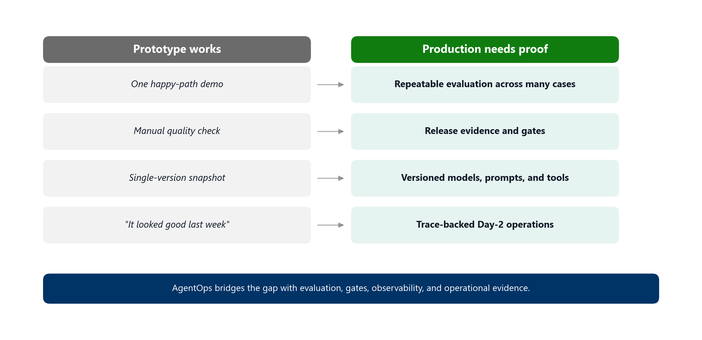

<!-- Speaker notes:
- Teams can stand up a GenAI prototype in days - but getting to production is a different story. That gap is what we call the production gap
- Production introduces new operational risk: quality, safety, monitoring, cost, ownership, and release confidence
- Agents add non-determinism, tool-calling risk, prompt regression, and changing user behavior
- So what exactly are we managing? The next slide breaks open the components that make an agent a production concern
-->

---

# Building blocks of a production agent
> Each tier adds components and complexity - a production agent manages all of these simultaneously

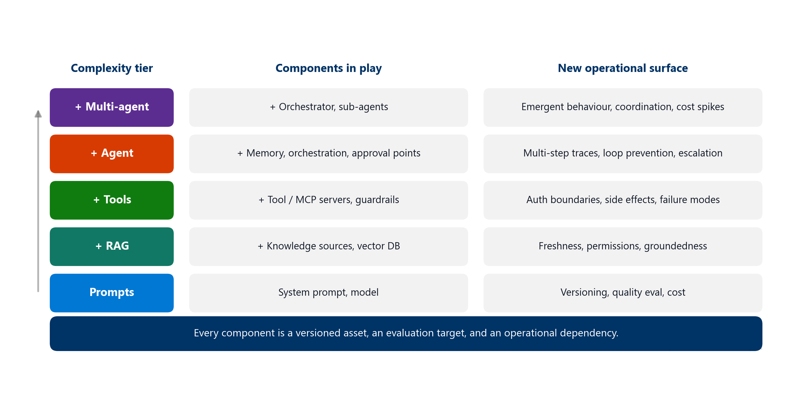

<!-- Speaker notes:
- What makes an agent a production concern? Not just a prompt and a model - layers of capability each bring their own operational surface
- Simple prompts: system prompt + model. Operational surface is versioning, quality eval, and cost
- Add RAG: knowledge sources, freshness, permissions, groundedness
- Add tools: MCP servers, guardrails, auth boundaries, side effects, failure modes
- Add agent autonomy: memory, orchestration, approval points, multi-step traces, loop prevention, escalation
- Add multi-agent: orchestrator, sub-agents, emergent behaviour, coordination, cost spikes
- Even a simple tool-using agent is at tier 3, managing all components simultaneously. Each is a versioned asset, an evaluation target, and an operational dependency
- We need a platform to manage all of this - that is Foundry. Cross-reference: Topic 3 covers agent architectures in detail
- So what does Foundry give us as the control plane?
-->

---

# Microsoft Foundry is the control plane
> Foundry stays the control plane - AgentOps connects Foundry signals to release decisions and Day-2 action

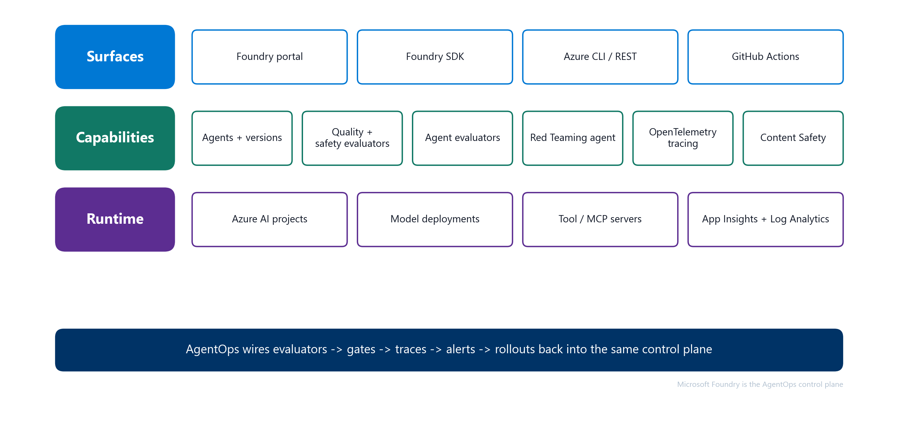

<!-- Speaker notes:
- We need a platform that orchestrates all these components - that platform is Microsoft Foundry, acting as the control plane
- Surfaces: portal, SDK, Azure CLI / REST, and GitHub Actions
- Capabilities: agents and versions, quality + safety evaluators, agent-specific evaluators, Red Teaming agent, OpenTelemetry tracing, Content Safety
- Runtime: Azure AI projects, model deployments, tool / MCP servers, App Insights and Log Analytics
- AgentOps adds the repeatable operating model around Foundry - it is not a replacement
- Now the question becomes: what evidence do we need to prove a version is safe to ship? That is the production readiness checklist
-->

---

# Production readiness checklist
> The checklist turns "I think it works" into "we have evidence for this release"

- Target and version are explicit
- Eval dataset and thresholds exist
- CI/CD gate blocks regressions
- Telemetry and traces are wired
- Safety and red-team findings are tracked
- Release evidence is reviewable
- Owners know what to do when signals fail

<!-- Speaker notes:
- How do we know a version is actually safe to ship? The production readiness checklist answers that
- It is the contract for any production-candidate agent. Every item maps to one or more later slides
- Walk the audience through each item briefly so they hold it as the mental model for the rest of the session
- But where does your team sit today against this checklist? The maturity model helps you locate yourself
-->

---

# Maturity model
> Most teams sit between Initial and Defined - start by moving one production-candidate agent up one level

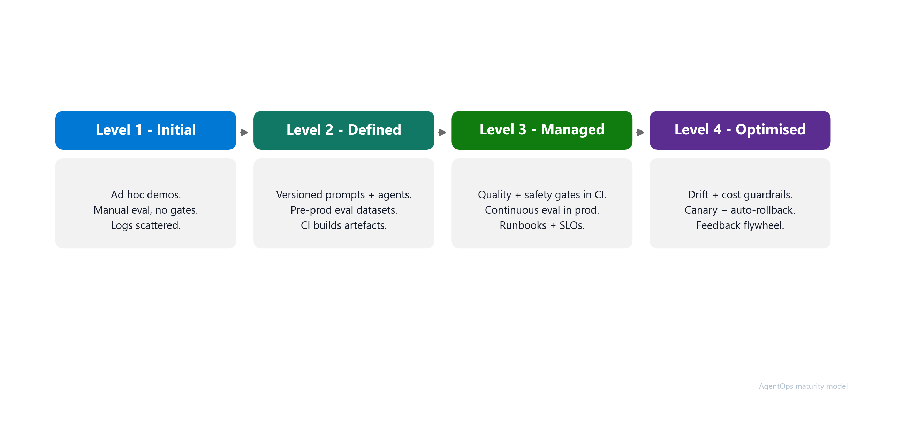

<!-- Speaker notes:
- The checklist defines what good looks like - the maturity model tells you where you are today
- Initial: ad hoc demos, manual eval, no gates, scattered logs
- Defined: versioned prompts and agents, pre-prod eval datasets, CI builds artefacts
- Managed: quality and safety gates in CI, continuous evaluation in production, runbooks and SLOs
- Optimised: drift and cost guardrails, canary plus auto-rollback, feedback flywheel
- The practical move is not to boil the ocean - pick one production-candidate agent and move it up one level
- The question is: how do we produce this evidence repeatably, every release, without heroics? That is what the operating model gives us
-->

---

# AgentOps operating model
> Four pillars - Evaluate, ship, observe, and own production agents

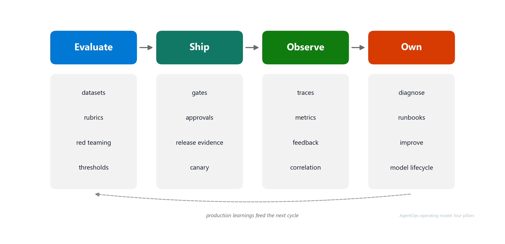

<!-- Speaker notes:
- The checklist tells us what evidence we need. The operating model tells us how to apply it across the agent lifecycle
- AgentOps applies DevOps discipline to AI agents, where behavior is probabilistic and releases need evidence
- The model has four pillars:
- Evaluate pre-production behavior using golden datasets, rubrics, red teaming, and thresholds
- Ship with CI/CD gates, release evidence, human approvals, environment promotion, and canary
- Observe production behavior through traces, metrics, logs, content safety signals, feedback, cost, and latency
- Own the workload through diagnosis, incident response, runbooks, model lifecycle, cost management, capacity management, and continuous improvement
- The output is release evidence and operational confidence
- Before we dive into each pillar, let us see what this model looks like as a reference architecture on Foundry
-->

---

# AgentOps Architecture
> A complete architecture for AgentOps inner and outer loop

<!-- Speaker notes:
- Same four-pillar model, drawn as a reference architecture on Foundry. The conceptual model becomes concrete components on the right
- Inner loop "Create, Evaluate, Improve" (left column): sandbox Foundry Project for agent types / instructions / tools / models, source control in ADO or GitHub holding release candidate + CI workflow + eval evidence, authoring tools (Copilot CLI, VS Code) for prompt edits and local evals, agent frameworks (Microsoft Agent Framework, LangGraph) for orchestration and MCP tools
- Outer loop "Operationalizing" (right block): Continuous Delivery via ADO or GitHub Actions promotes the agent through dev (shared development), qa (staging / test - validation and release evidence), and prod (shipping target) - each one its own Foundry Project
- Pipeline chips get stricter per environment: dev runs manual tests + quality evals + safety eval; qa adds integration tests + red team; prod runs smoke tests + blue/green + A/B tests (no re-eval - the evidence is locked at qa)
- Agent runtime choice is identical in every environment: Prompt Agent (Foundry-managed prompt + tools + knowledge) or Hosted Agent (Container Image -> ACR -> Agent Service), with BYO Compute Custom Runtime on ACS or AKS for full control
- Between qa and prod, the human Gated approval - backed by the release evidence package, not a rubber-stamp click
- Observability & Control (bottom): the Foundry Control Plane, organised the way the Operate nav organises it - Overview (alerts, success rate, cost), Assets (agents, models, tools), Compliance (guardrail, security posture, data governance), Quota (TPM, PTU, rate limiting)
- Telemetry backend strip: Azure Monitor for dashboards + alerts, Application Insights for traces / spans / app telemetry - this is where Foundry traces flow to
- Two telemetry feeds (dashed): Observability & Control collects signals from dev and from prod
- Feedback loop (dashed, going left): production learnings flow back into the inner loop so the next iteration of prompts, tools and evaluators is informed by what really happened in prod
- With the architecture in mind, let us start with the first pillar: Evaluate
-->

---

<!-- _class: lead -->

# Demo
## Let's see this in action

<!-- Speaker notes:
- Live demo or recorded walkthrough showing the AgentOps operating model in practice
- Walk through the inner loop, evaluation, gating, and observability on Foundry
-->

---

<!-- _class: lead -->

# Evaluate
## The release signal for agentic systems

---

# Evaluation strategy
> Evaluation is not a one-time score - it's the release signal that grows as production teaches you new failure modes

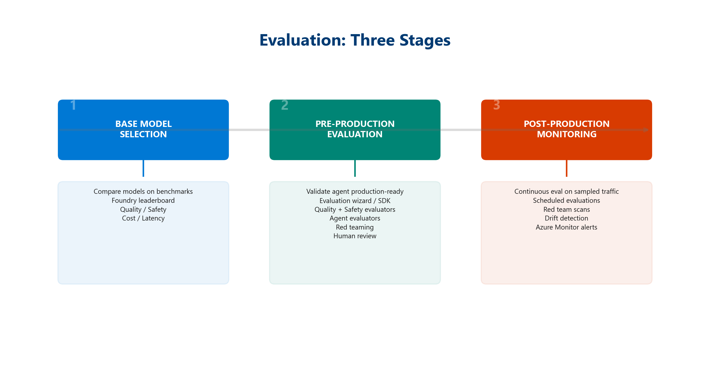

<!-- Speaker notes:
- This is the Evaluate pillar. Without a quality signal, there is nothing to ship with confidence
- Start with a small golden dataset tied to real user journeys
- Evaluate quality, groundedness, latency, cost, and behavior. Compare against baselines and previous versions
- Promote reviewed production traces into future regression cases
- A few dozen representative cases beat zero cases
- Use Foundry's built-in evaluators for quality, groundedness, and agent metrics like intent resolution and tool call accuracy
- The eval dataset is a living artifact - every reviewed production trace can become a new test row
- But quality evaluation alone is not enough - we also need to test adversarial scenarios
-->

---

# Red teaming and AI safety
> Quality asks "is the answer good?" Red teaming asks "can someone make it misbehave?" Both are required

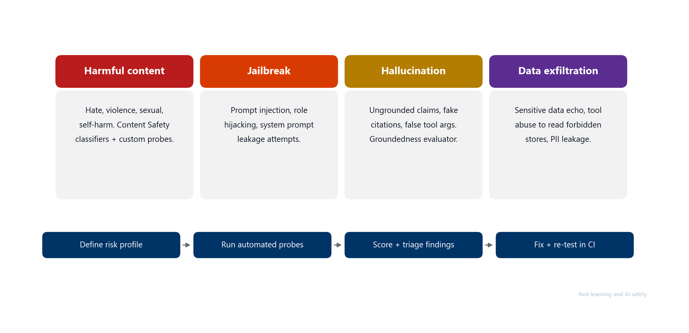

<!-- Speaker notes:
- Quality evaluation tells us if the answer is good - but it will not tell us if someone can make the agent misbehave. That is red teaming
- Safety and quality are different signals - quality scoring will not catch a jailbreak
- Foundry ships an AI Red Teaming Agent backed by Microsoft's PyRIT framework for automated adversarial testing
- Four risk categories: harmful content, jailbreak (prompt injection, role hijacking), hallucination (ungrounded claims), data exfiltration (PII leakage, tool abuse)
- Cadence: pre-release gate, scheduled weekly, post-incident
- Findings feed the eval dataset as adversarial rows for future regression coverage
- New at Build 2026: Adaptive Evaluations (preview) convert safety and governance policies directly into automated tests. Paired with ASSERT (Agent Security and Safety Evaluation Run-Time), teams can turn policies into repeatable eval coverage without hand-writing every test case
- Now that we have evaluation and red teaming producing signals, how do we enforce them? That brings us to Ship
-->

---

<!-- _class: lead -->

# Ship
## Gates that enforce release evidence

---

# CI/CD gates for agentic AI
> The strongest moment is a failed gate - if the prompt regresses, the pipeline stops before users experience it

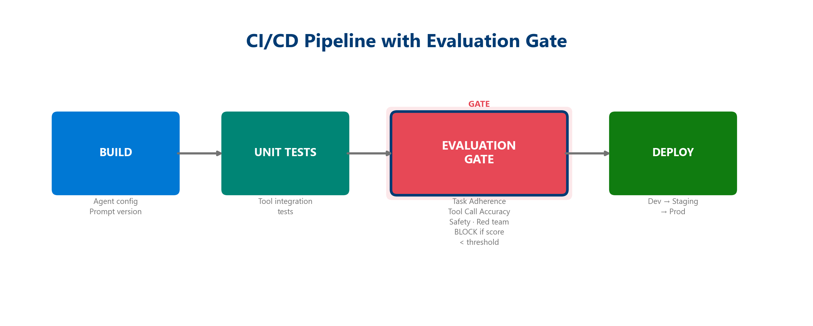

<!-- Speaker notes:
- This is the Ship pillar. Signals without enforcement are just reports nobody reads, and CI/CD gates are where DevOps discipline meets agentic systems
- PR gates block bad prompts before merge
- Deploy gates block bad versions before they reach the next environment
- Watchdogs catch drift between releases
- Every gate produces an artifact: eval report, readiness report, release evidence
- New at Build 2026: Agent Control Specification (ACS) extends gates into runtime. ACS defines eight interception points across the agent lifecycle (startup, input, pre/post-model-call, pre/post-tool-call, output, shutdown) where policies are enforced as code. Works across Foundry, Microsoft Agent Framework, and LangChain. Published open-source under the Agent Governance Toolkit on GitHub
- With gates enforcing quality, the next question is what happens after we ship. That is where Observe comes in
-->

---

<!-- _class: lead -->

# Observe
## Traces, correlation, and the closed loop

---

# Observability for agents is more than monitoring
> Infrastructure monitoring asks "is the service healthy?" Agent observability asks "what did it do and why?"

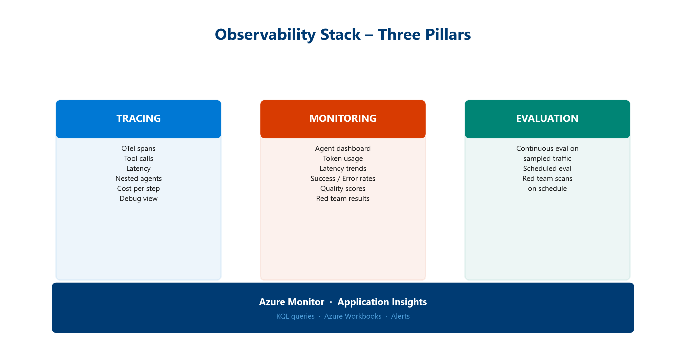

<!-- Speaker notes:
- This is the Observe pillar. Gates enforce quality before release, but once the agent is live we need to understand what it is doing and why
- For agents, the unit of understanding is the trace - the chain of decisions, not just the endpoint status
- Required signals: prompt, plan, model call, retrieval, tool call, safety event, latency, cost, user feedback, release version
- Required correlation: trace ID, session ID, agent version, deployment, eval run, incident, owner
- Without correlation, observability is just disconnected dashboards. With it, the same trace answers questions across release, runtime, evaluation, and Day-2
- But signals alone are not the goal - what matters is what you do with them
-->

---

# From telemetry to action
> The end state is not a dashboard. The end state is action: observe, diagnose, improve, and ship the next version with evidence

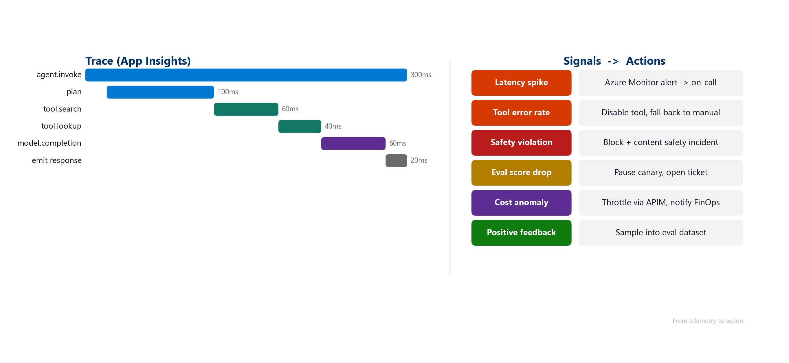

<!-- Speaker notes:
- Collecting signals is not the end goal - what matters is turning them into action. This slide is the connective tissue of the whole session
- A trace explains a failure. A reviewed trace becomes a new eval row. The eval row enters the gate. The gate prevents recurrence
- Latency spike -> Azure Monitor alert -> on-call
- Tool error rate -> disable tool, fall back to manual
- Safety violation -> block plus content safety incident
- Eval score drop -> pause canary, open ticket
- Cost anomaly -> throttle via APIM, notify FinOps
- Positive feedback -> sample into eval dataset
- This is how Observe feeds Own, and how Own feeds the next Evaluate and Ship cycle
-->

---

<!-- _class: lead -->

# Own
## Running agents in production

---

# Day-2 operations - four concerns
> AgentOps is not done at release - production traces and red-team findings feed the next evaluation set

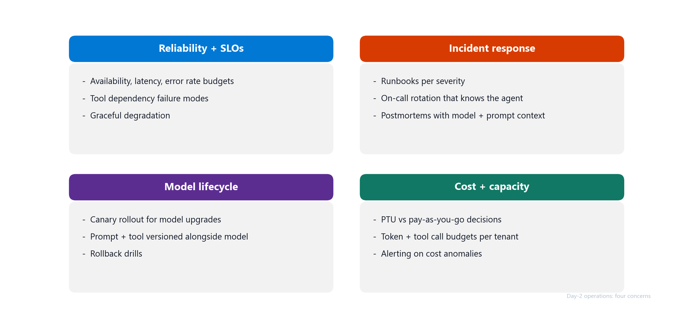

<!-- Speaker notes:
- This is the Own pillar. Shipping is not the finish line, it is where the real operational work begins. Day-2 has four concerns teams need to own
- Reliability and SLOs: availability, latency, error rate budgets; tool dependency failure modes; graceful degradation
- Incident response: runbooks per severity; on-call rotation that knows the agent; postmortems with model plus prompt context
- Model lifecycle: canary rollout for upgrades; prompt and tool versioned alongside model; rollback drills
- Cost and capacity: PTU vs pay-as-you-go; token and tool call budgets per tenant; alerting on cost anomalies
- The four concerns are interlocking - each creates signals that feed back into evaluation and the next release
- Governance umbrella: Microsoft Agent 365 (GA May 2026) provides the observe, govern, and secure control plane across all agents in the enterprise. The SDK is free and framework-agnostic - works with Microsoft Agent Framework, OpenAI Agents SDK, LangChain, Semantic Kernel. Brings custom and third-party agents under one governance umbrella so Day-2 visibility and policy enforcement are consistent
- The next two slides go deeper into incident response and model lifecycle
-->

---

# AI incident runbook
> Containment first - evidence-backed fix second

| Severity | Example | First action |
|---|---|---|
| S1 Critical | Safety event or data leak in production | Stop gate, rollback to last good version |
| S2 High | Quality or grounding regression after deploy | Planned rollback or version pin |
| S3 Medium | Latency degradation or cost spike | Rate-limit, investigate, then act |
| S4 Low | Drift indicator on a single metric | Schedule analysis in the next eval cycle |

Triage flow:
**Detect -> Correlate trace -> Identify version -> Contain -> Analyze -> Fix -> Re-evaluate -> Close with evidence**

<!-- Speaker notes:
- When something goes wrong in production, you need a structured response - not a fire drill. The runbook turns chaos into a sequence
- The severity table sets expectations so teams do not over-react or under-react
- The triage flow makes containment explicit - stop the bleed before debugging
- The runbook is part of Own because it turns production signals into containment, evidence-backed fixes, and future evaluation coverage
- Every closed incident produces evidence that updates the eval dataset, the gate criteria, or the operating model
- The other recurring Day-2 challenge is model lifecycle - let us look at that next
-->

---

# Model lifecycle and canary upgrades
> Treat every model change as a release candidate, not a config flip

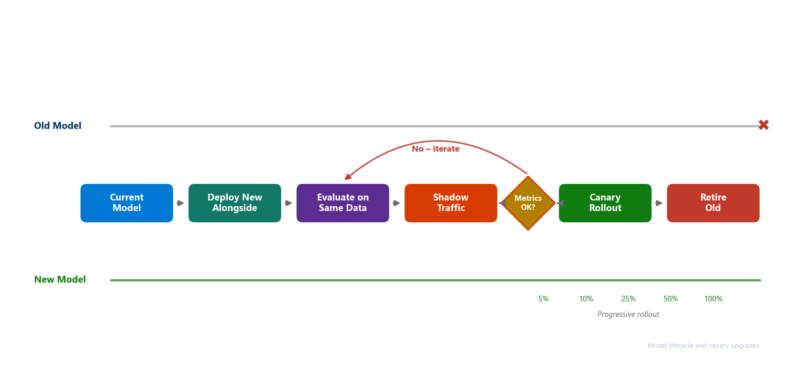

<!-- Speaker notes:
- When the model itself changes - deprecation, new versions, cost pressure - that is model lifecycle. The recurring pain point: "the model we depend on is being deprecated, what now?"
- The answer: same gates and evidence as any other release candidate
- Triggers: deprecation, new model availability, cost or performance pressure, vendor change
- Canary process: pin current model as baseline; run new model against eval dataset offline; promote to canary traffic slice; compare live quality, cost, latency, safety; roll forward or roll back with evidence
- Ownership: AI platform team coordinates, application team validates
- Model lifecycle is part of Own because every model, prompt, or tool change becomes a new release candidate that must go back through Evaluate and Ship
- Canary upgrades map cleanly to model changes if the eval dataset and release contract are already in place
- We have covered the full loop - now the question is: where do you start?
-->

---

<!-- _class: lead -->

# Adoption
## Start small, build the pattern

---

# Start with one production-candidate agent
> Your 30-day goal - move one agent from "it works in testing", to "we can operate it safely"

1. **Pick one agent** that is close to production
2. **Evaluate** it with release criteria and a small eval dataset
3. **Ship** it with PR gates, deploy gates, and readiness evidence
4. **Observe** it with telemetry, traces, dashboards, and alerts
5. **Own** it with weekly evidence reviews and production learnings
6. Feed learnings back into the next evaluation cycle

<!-- Speaker notes:
- You do not need to boil the ocean. Start with one production-candidate agent and apply the four pillars end to end: evaluate it, ship it with evidence, observe it in production, and own the next improvement cycle
- Once the pattern is proven on one agent, it scales across the portfolio without re-litigating every decision
- Thank you - we are happy to take questions
-->

---

<!-- _class: lead -->

# Thank You
## Questions and Discussion

<!-- Speaker notes:
- Thank you for your time today
- We have ten minutes for questions
- Happy to go deeper on any of the pillars - evaluation datasets, CI/CD gate design, observability correlation, or Day-2 operations
- If you want to continue the conversation, reach out to your account team or find us after the session
-->
