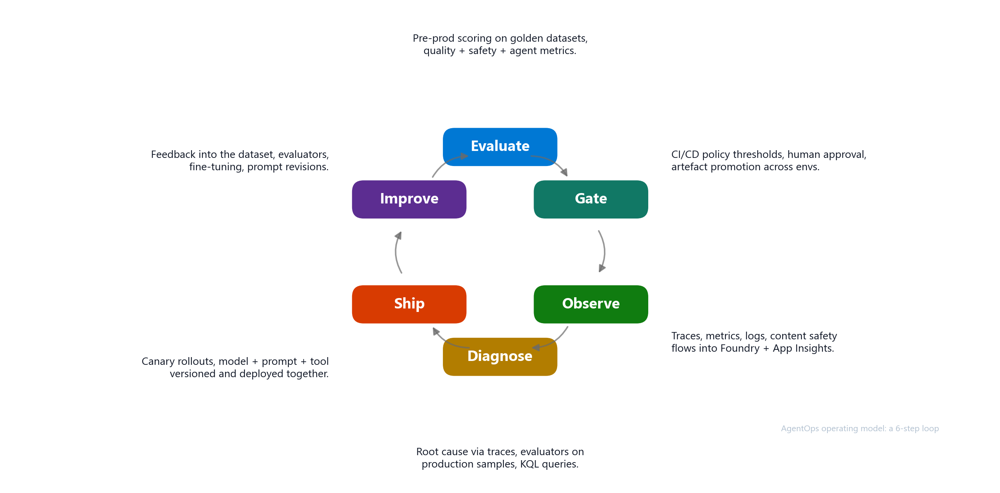

<!-- _class: lead -->

# AgentOps
## From Agent Prototype to Production

<!-- Speaker notes: Welcome. This session is about the operating model for moving AI agents from prototype to production on Microsoft Foundry. The question we keep coming back to is simple - can we safely ship this version of the agent, and where is the evidence? Audience: AI application builders, architects, DevOps and platform teams, AI governance stakeholders, and technical decision makers responsible for production AI systems. Prerequisites in the broader program: Topic 2 (AI Landing Zones) and Topic 3 (Agent Architectures). -->

---

# Agenda

1. **AgentOps Foundations** - why AI ops is different and the operating loop
2. **Evaluation** - quality, grounding, behavior, and red teaming
3. **CI/CD for Agentic AI** - gates, evidence, and environment promotion
4. **Observability** - traces, correlation, and the closed loop
5. **Day-2 Operations** - incident runbook and model lifecycle
6. **Adoption** - start with one production-candidate agent

<!-- Speaker notes: Six concise blocks for one hour. The story flows from why agents need a new operating model, through how teams produce release evidence, into how observability and Day-2 operations close the loop. The session ends with a practical 30-day starting path. -->

---

<!-- _class: lead -->

# AgentOps Foundations
## Why AI operations need a new discipline

---

# The production gap

> The bottleneck moved from building the first demo to proving that the next version is safe to release.

<!-- Speaker notes: Teams can build GenAI prototypes quickly. Production introduces new operational risk. The hard questions are no longer about building the first demo - they are about quality, safety, monitoring, cost, ownership, and release confidence. Agents add non-determinism, tool-calling risk, prompt regression, and changing user behavior. So what exactly are we managing? The next slide breaks open the components that make an agent a production concern. Source: GenAIOps PoC-to-production / adoption-friction material. -->

---

# Building blocks of a production agent

> Each tier adds components and complexity. A production agent manages all of these simultaneously.

<!-- Speaker notes: This combines the anatomy and the complexity story into one visual. At the bottom: simple prompts. You have a system prompt and a model. The operational surface is versioning, quality eval, and cost. Add RAG: now you also manage knowledge sources, freshness, permissions, groundedness. Add tools: now you have MCP servers, guardrails, auth boundaries, side effects, failure modes. Add agent-level autonomy: memory, orchestration, approval points, multi-step traces, loop prevention, escalation. Add multi-agent: orchestrator, sub-agents, emergent behaviour, coordination, cost spikes. The point is not that everyone is doing multi-agent. The point is that even a simple tool-using agent puts you at tier 3, managing all of those components simultaneously. Each one is a versioned asset, an evaluation target, and an operational dependency. So we need a platform that can manage all of this - that is Foundry. Cross-reference: Topic 3 covers agent architectures in detail. Source: GenAIOps complexity-levels content (slide 6). -->

---

# Microsoft Foundry is the control plane

> Foundry stays the control plane. AgentOps connects Foundry signals to release decisions and Day-2 action.

<!-- Speaker notes: Clarify positioning. Foundry surfaces include the portal, SDK, Azure CLI / REST, and GitHub Actions. Foundry capabilities cover agents and versions, quality + safety evaluators, agent-specific evaluators, the Red Teaming agent, OpenTelemetry tracing, and Content Safety. The runtime is Azure AI projects, model deployments, tool / MCP servers, plus App Insights and Log Analytics for runtime observability. AgentOps adds the repeatable operating loop around them - it is not a replacement for Foundry. Now that we know the components and the platform, the question becomes: what evidence do we need to prove a version is safe to ship? That is the production readiness checklist. Source: GenAIOps Azure AI Foundry and monitoring material. -->

---

# Production readiness checklist

- Target and version are explicit
- Eval dataset and thresholds exist
- CI/CD gate blocks regressions
- Telemetry and traces are wired
- Safety and red-team findings are tracked
- Release evidence is reviewable
- Owners know what to do when signals fail

> The checklist turns "I think it works" into "we have evidence for this release."

<!-- Speaker notes: This is the contract for any production-candidate agent. Every item maps to one or more later slides. Walk the audience through each item briefly so they can hold it as the mental model for the rest of the session. The question is: how do we produce this evidence repeatably, every release, without heroics? That is what the operating model gives us. -->

---

# AgentOps operating model

> People - Process - Platform working as one operating loop. The six steps are the heart of the session.

<!-- Speaker notes: AgentOps applies DevOps discipline to AI agents, where behavior is probabilistic and releases need evidence. The loop is the heart of the session - everything that follows is one of these six steps. Evaluate pre-prod on golden datasets. Gate at CI/CD with policy thresholds and human approval. Observe traces, metrics, logs, content safety in Foundry plus App Insights. Diagnose root cause via traces and evaluators on production samples. Ship via canary, with model + prompt + tool versioned together. Improve by feeding production learnings into the next evaluation set. The goal is continuous value with controlled operational risk. The output is release evidence and operational confidence. Source: GenAIOps people/process/platform; AgentOps operating model. -->

---

<!-- _class: lead -->

# Evaluation
## The release signal for agentic systems

---

# Evaluation strategy

> Evaluation is not a one-time score. It is the release signal that grows as production teaches you new failure modes.

<!-- Speaker notes: Start with a small golden dataset tied to real user journeys. Evaluate quality, groundedness, latency, cost, and behavior. Compare against baselines and previous versions. Promote reviewed production traces into future regression cases. The minimum viable evaluation is small but real. A few dozen representative cases beat zero cases. Use Foundry's built-in evaluators for quality, groundedness, and agent metrics like intent resolution and tool call accuracy. The eval dataset is a living artifact - every reviewed production trace can become a new test row. Source: GenAIOps evaluation slides 32-34. -->

---

# Red teaming and AI safety

> Quality asks "is the answer good?" Red teaming asks "can someone make it misbehave?" Both are required.

<!-- Speaker notes: Safety and quality are different signals. Quality scoring will not catch a jailbreak. Foundry ships an AI Red Teaming Agent backed by Microsoft's PyRIT framework so teams can automate adversarial testing rather than doing it ad-hoc. Four risk categories: harmful content (hate, violence, sexual, self-harm), jailbreak (prompt injection, role hijacking), hallucination (ungrounded claims, fake citations), and data exfiltration (PII leakage, tool abuse). Cadence: pre-release gate, scheduled weekly, post-incident. Findings feed the eval dataset as adversarial rows for future regression coverage. Source: GenAIOps slide 38 (PyRIT / AI Red Teaming Agent), slide 42 (Content Safety). -->

---

<!-- _class: lead -->

# CI/CD for Agentic AI
## Gates that enforce release evidence

---

# CI/CD gates for agentic AI

> The strongest moment is a failed gate. If the prompt regresses, the pipeline stops before users experience it.

<!-- Speaker notes: This is where DevOps discipline meets agentic systems. PR gates block bad prompts before merge. Deploy gates block bad versions before they reach the next environment. Watchdogs catch drift between releases. Every gate produces an artifact that becomes part of the release evidence: eval report, readiness report, release evidence. Source: GenAIOps CI/CD content (slides 48, 50, 52) and AgentOps end-to-end workflow generation. -->

---

<!-- _class: lead -->

# Observability
## Traces, correlation, and the closed loop

---

# Observability for agents is more than monitoring

> Infrastructure monitoring asks "is the service healthy?" Agent observability asks "what did it do and why?"

<!-- Speaker notes: For agents, the unit of understanding is the trace. We need to see the chain of decisions, not just the endpoint status. Required signals: prompt, plan, model call, retrieval, tool call, safety event, latency, cost, user feedback, release version. Required correlation: trace ID, session ID, agent version, deployment, eval run, incident, owner. Without correlation across version, deployment, eval, and incident, observability is just a set of disconnected dashboards. With correlation, the same trace can answer questions across release, runtime, evaluation, and Day-2 contexts. Source: GenAIOps monitoring slide 58; Foundry tracing concepts. -->

---

# From telemetry to action

> The end state is not a dashboard. The end state is action: observe, diagnose, add eval case, gate, ship.

<!-- Speaker notes: This slide is the connective tissue of the whole session. Telemetry is not the goal - action is. A trace explains a failure. A reviewed trace becomes a new eval row. The new eval row enters the gate. The gate prevents the same failure from reaching production again. Latency spike -> Azure Monitor alert -> on-call. Tool error rate -> disable tool, fall back to manual. Safety violation -> block plus content safety incident. Eval score drop -> pause canary, open ticket. Cost anomaly -> throttle via APIM, notify FinOps. Positive feedback -> sample into eval dataset. This is how observability funds evaluation, and evaluation funds release confidence. Source: GenAIOps monitoring and operations content; AgentOps tutorial trace learning. -->

---

<!-- _class: lead -->

# Day-2 Operations
## Running agents in production

---

# Day-2 operations - four concerns

> AgentOps is not done at release. Production traces and red-team findings feed the next evaluation set.

<!-- Speaker notes: This is the Day-2 section opener. Day-2 is where most of the operational reality lives - long after the launch demo. Reliability and SLOs: availability, latency, error rate budgets; tool dependency failure modes; graceful degradation. Incident response: runbooks per severity; on-call rotation that knows the agent; postmortems with model plus prompt context. Model lifecycle: canary rollout for upgrades; prompt and tool versioned alongside model; rollback drills. Cost and capacity: PTU vs pay-as-you-go decisions; token and tool call budgets per tenant; alerting on cost anomalies. The four concerns are interlocking, not independent. Each one creates signals that feed back into evaluation and the next release. The next two slides go deeper into incident response and model lifecycle. Source: GenAIOps monitoring, gateway, governance, safety, and cost content. -->

---

# AI incident runbook

| Severity | Example | First action |
|---|---|---|
| S1 Critical | Safety event or data leak in production | Stop gate, rollback to last good version |
| S2 High | Quality or grounding regression after deploy | Planned rollback or version pin |
| S3 Medium | Latency degradation or cost spike | Rate-limit, investigate, then act |
| S4 Low | Drift indicator on a single metric | Schedule analysis in the next eval cycle |

Triage flow:
**Detect -> Correlate trace -> Identify version -> Contain -> Analyze -> Fix -> Re-evaluate -> Close with evidence**

> Containment first. Evidence-backed fix second.

<!-- Speaker notes: When an agent misbehaves in production, the runbook turns a fire drill into a sequence. The severity table sets expectations so teams do not over-react or under-react. The triage flow makes containment explicit - stop the bleed before debugging. Every closed incident produces evidence that updates the eval dataset, the gate criteria, or the operating model. -->

---

# Model lifecycle and canary upgrades

> Treat every model change as a release candidate, not a config flip.

<!-- Speaker notes: Model lifecycle is the recurring pain point we hear from customers - "the model we depend on is being deprecated, what now?" The answer is the same gates and evidence as any other release candidate. Triggers: deprecation, new model availability, cost or performance pressure, vendor change. Canary process: pin current model version as baseline; run new model against the eval dataset offline; promote to a canary traffic slice; compare live quality, cost, latency, safety against baseline; roll forward or roll back with evidence. Ownership: AI platform team coordinates, application team validates. Canary upgrades are not new to DevOps, but they map cleanly to model changes if the eval dataset and release contract are already in place. Source: GenAIOps slide 17 (model and version update), slides 22-24 (model selection). -->

---

<!-- _class: lead -->

# Adoption
## Start small, build the pattern

---

# Maturity model

> Most teams sit between Initial and Defined. Start by moving one production-candidate agent up one level.

<!-- Speaker notes: Quick self-assessment. Where is your team right now? Initial: ad hoc demos, manual eval, no gates, scattered logs. Defined: versioned prompts and agents, pre-prod eval datasets, CI builds artefacts. Managed: quality and safety gates in CI, continuous evaluation in production, runbooks and SLOs. Optimised: drift and cost guardrails, canary plus auto-rollback, feedback flywheel. The practical move is not to boil the ocean. Pick one production-candidate agent and move it up one level. Source: GenAIOps maturity model (slides 14-15). -->

---

# Start with one production-candidate agent

30-day start:

1. **Pick one agent** that is close to production
2. Define **release criteria** and a small **eval dataset**
3. Wire **telemetry, traces, dashboards, alerts**
4. Add **PR and deploy gates**
5. Review **readiness evidence** weekly
6. Promote **production learnings** into future evals

> Move one agent from "it works in testing" to "we can operate it safely."

<!-- Speaker notes: Close with a practical adoption path. Do not start with every agent. Start with one production-candidate agent and build the repeatable pattern. Once the pattern is proven on one agent, it scales across the portfolio without re-litigating every decision. Source: GenAIOps key-takeaways content and AgentOps adoption blueprint. -->
